# ECS Pipeline Construction Dashboard - Data Flow & Component Architecture Map

## 📊 High-Level Architecture

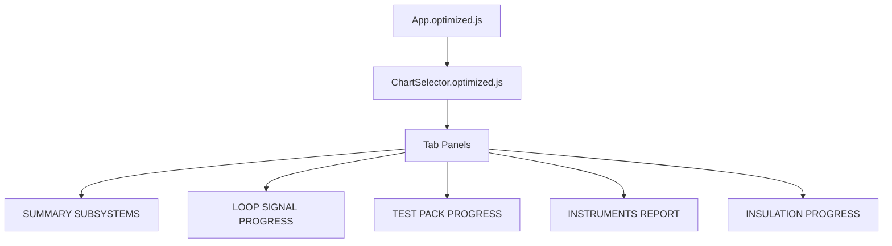

## 🗂️ Data Sources & Loading

### Primary Data Files
```
/data/
├── pipelinedata.csv          → Summary Subsystems
├── master_subsystem.parquet  → Loop Signal Progress
├── tp_with_progress.csv      → Test Pack Progress
├── control_inst_by_isos.csv  → Instruments Control
├── details_inst.csv          → Instruments Details
├── aislamientos.csv          → Insulation Progress
└── ssm.csv                   → Subsystem Overview
```

### Data Loading Hooks
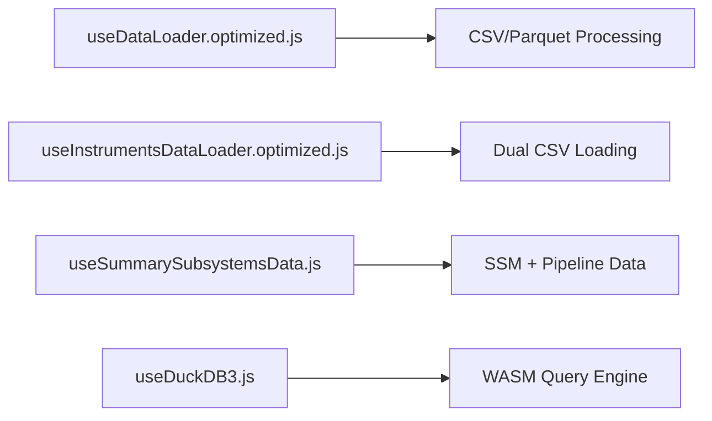

## 🎯 Tab-Specific Data Flow

### 1. SUMMARY SUBSYSTEMS Tab
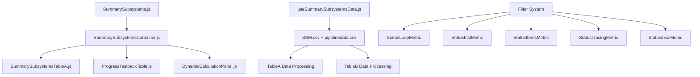

### 2. LOOP SIGNAL PROGRESS Tab
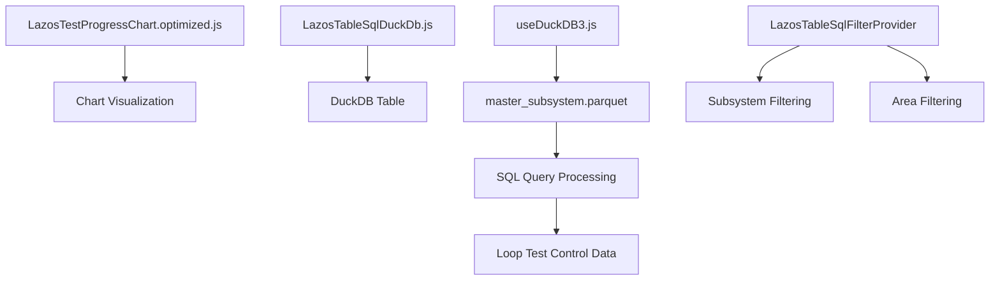

### 3. TEST PACK PROGRESS Tab
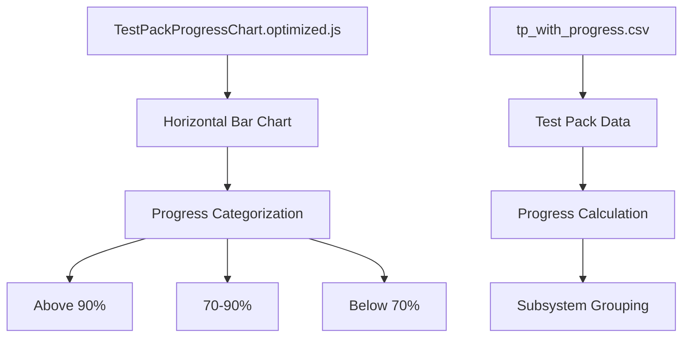

### 4. INSTRUMENTS REPORT Tab
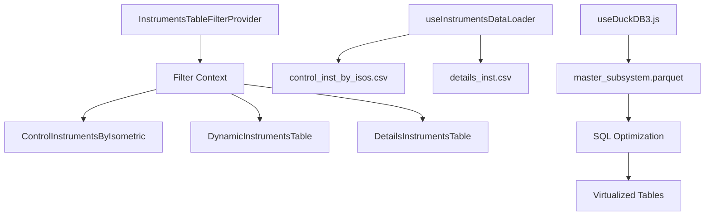

### 5. INSULATION PROGRESS Tab
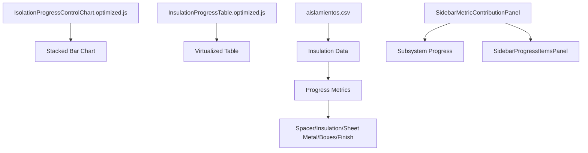

## 🔄 Filter System Architecture

### Multi-Level Filtering
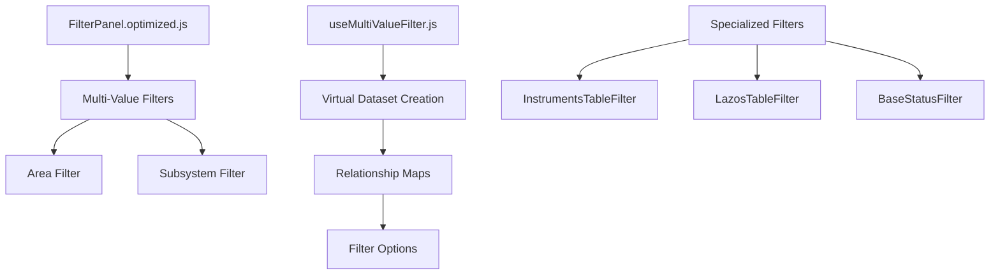

### Status Filters
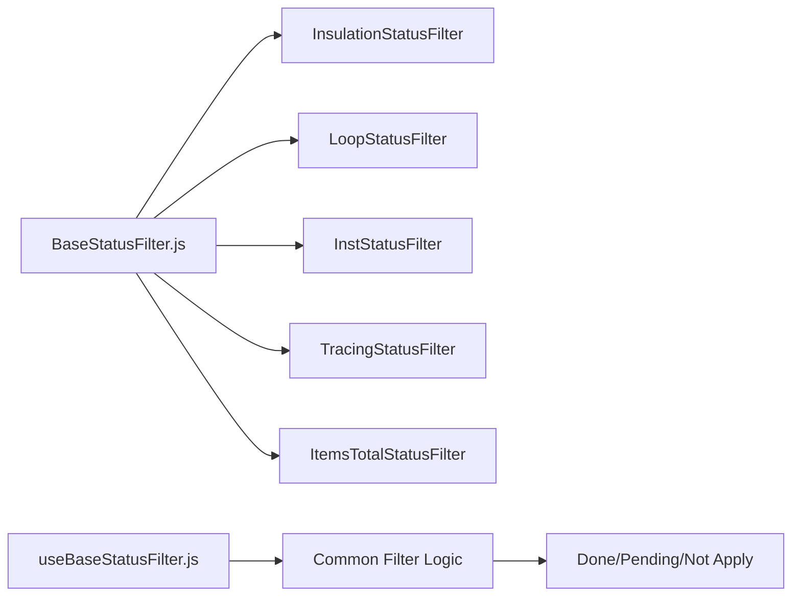

## 🧮 SQL & Calculation System

### Dynamic SQL Interface
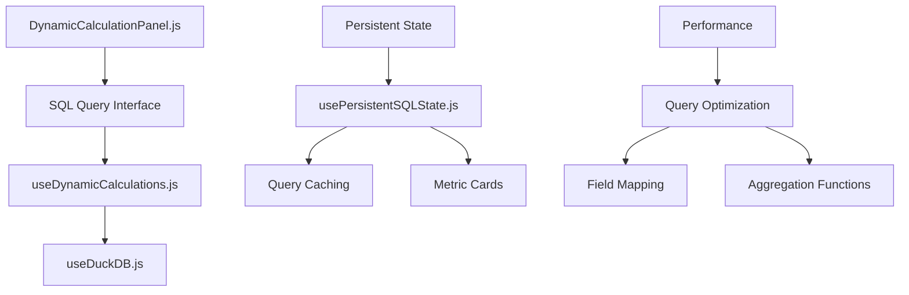

### WASM Optimization
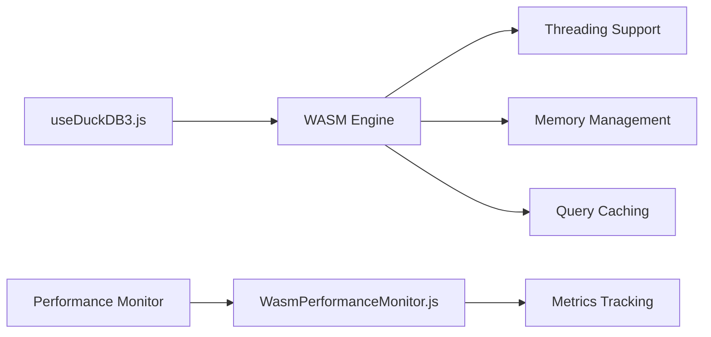

## 📊 Chart Components

### Chart Types by Tab
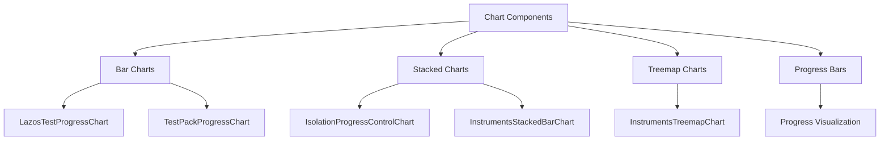

## 🎨 UI Components Architecture

### Base Components
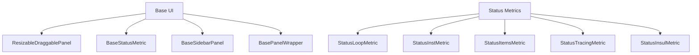

### Table Components
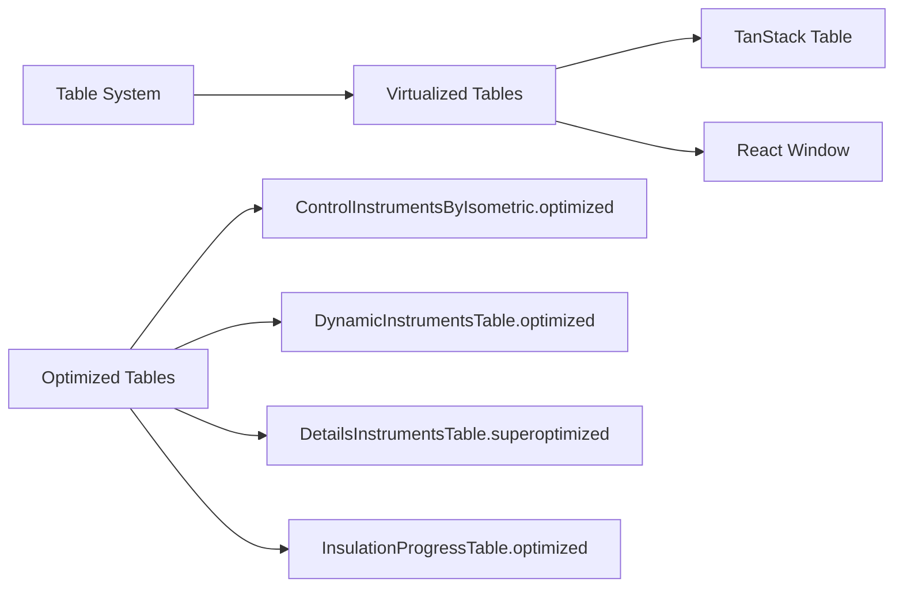

## 🔗 Data Relationships

### Cross-Table Relationships
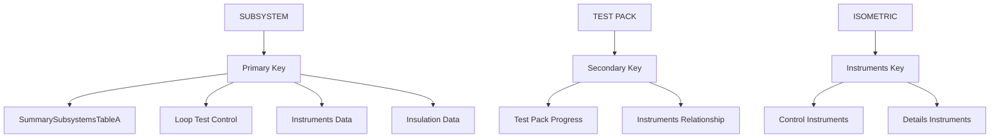

### Filter Propagation
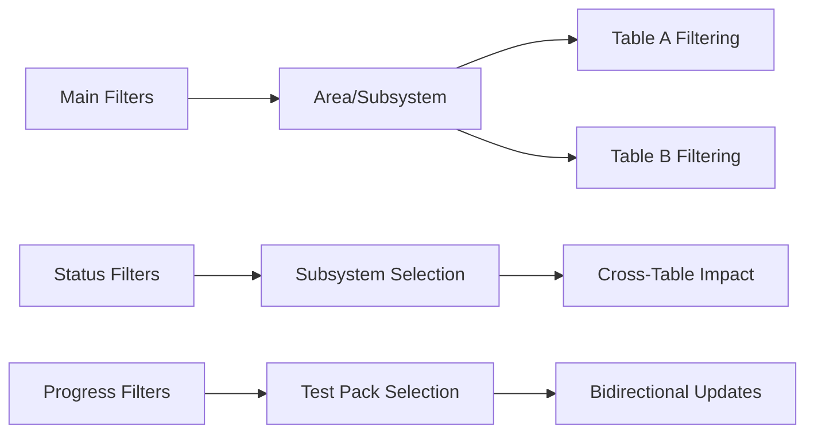

## ⚡ Performance Optimizations

### Optimization Layers
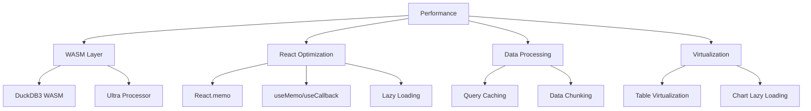

## 🎛️ State Management

### State Flow
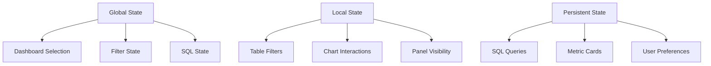

## 🔧 Hook Dependencies

### Custom Hooks Network
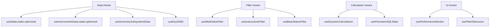

## 📱 Component Hierarchy

### Main App Structure
```
App.optimized.js
├── ChartSelector.optimized.js
│   ├── SummarySubsystems.js
│   │   ├── SummarySubsystemsContainer.js
│   │   │   ├── SummarySubsystemsTableA.js
│   │   │   ├── ProgressTestpackTable.js
│   │   │   ├── DynamicCalculationPanel.js
│   │   │   └── Status Metrics (Loop/Inst/Items/Tracing/Insul)
│   │   └── Various Filters (Insulation/Loop/Items/etc.)
│   ├── Loop Signal Progress
│   │   ├── LazosTestProgressChart.optimized.js
│   │   └── LazosTableSqlDuckDb.js
│   ├── Test Pack Progress
│   │   └── TestPackProgressChart.optimized.js
│   ├── Instruments Report
│   │   ├── ControlInstrumentsByIsometric.optimized.js
│   │   ├── DynamicInstrumentsTable.optimized.js
│   │   ├── DetailsInstrumentsTable.superoptimized.js
│   │   └── DynamicCalculationPanel.js
│   └── Insulation Progress
│       ├── IsolationProgressControlChart.optimized.js
│       └── InsulationProgressTable.optimized.js
├── FilterPanel.optimized.js
└── WasmPerformanceMonitor.js
```

This comprehensive map shows the complete data flow, component relationships, and architectural patterns used throughout the ECS Pipeline Construction Dashboard system.