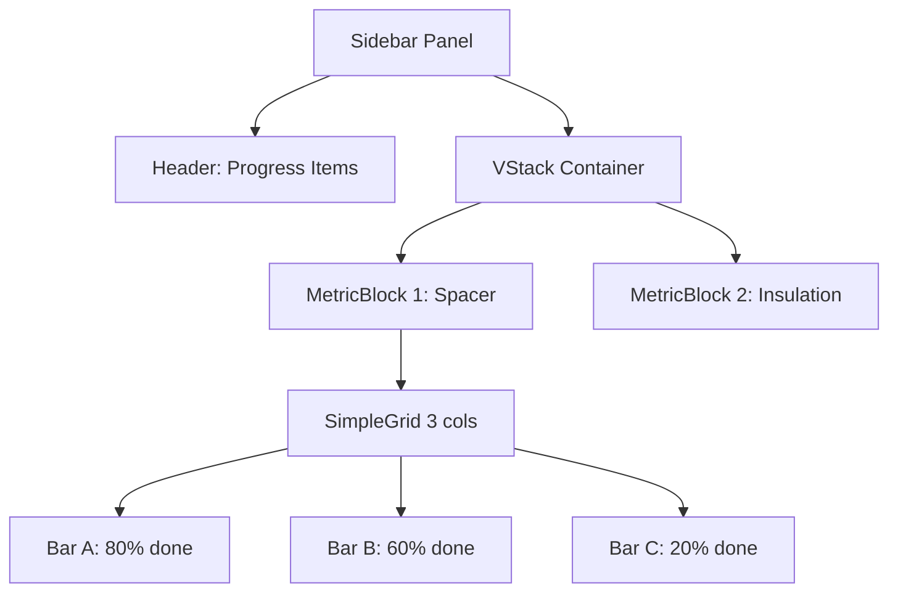
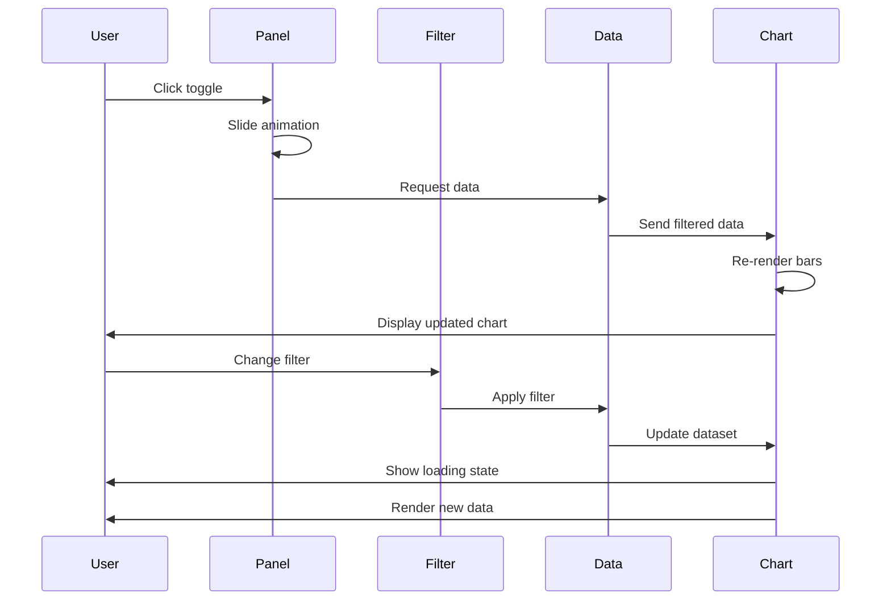

Amazon Q can now help you write, modify, and maintain code by combining the power of natural language understanding with the ability to take actions on your behalf such as directly making code changes, modifying files, and running commands.

---

Hi, I'm Amazon Q. I can answer your software development questions. 
                        Ask me to explain, debug, or optimize your code. 
                        You can enter `/` to see a list of quick actions.

---

tell which kind of layout has SidebarMetricContributionPanel.js

---

I need to find the SidebarMetricContributionPanel.js file to analyze its layout structure. Let me search for it in your workspace.

---

Now let me read the file to analyze its layout structure:

---


Based on the code analysis, **SidebarMetricContributionPanel.js** uses a **vertical stacked layout** with the following structure:

## Layout Type: **Vertical Grid Layout with Stacked Sections**

### Main Layout Components:
- **VStack** - Primary vertical container with sections stacked vertically
- **SimpleGrid** - 3-column grid layout within each metric section
- **Box** containers for individual metric blocks

### Layout Hierarchy:
1. **Header**: Title text centered at the top
2. **VStack**: Vertical stack container holding all metric blocks
3. **MetricBlock components**: Each containing:
   - Section title (centered)
   - **SimpleGrid** with 3 columns for subsystem contribution bars
   - Individual **SubsystemContributionBar** components

### Visual Structure:
- 6 metric sections stacked vertically (Spacer, Insulation, Sheet Metal, Boxes, Finish, Mleq Total)
- Each section displays subsystem data in a 3-column grid
- Individual bars show completion progress with color-coded segments (green for complete, pink for incomplete)

The layout is designed as a **sidebar panel** with compact, vertically-organized metric visualizations using Chakra UI's grid and stack components.

---

CAN YOU GIVE A DESCRIPTION MORE DETAILED ABOUT THAT CHART FOR A PROMPT AMAZON. I WANT TO LEARN HOW COMMUNICATE DASHBOARD INSTRUCTIONS TO AMAZON Q

---


Here's a detailed description of the SidebarMetricContributionPanel chart for Amazon Q prompts:

## 📊 Chart Description: SidebarMetricContributionPanel Component

### **Chart Type & Layout Structure**
- **Layout Pattern**: Vertical stacked sidebar panel with grid-based metric sections
- **Container Structure**: VStack (vertical stack) containing multiple MetricBlock components
- **Grid Layout**: Each metric section uses SimpleGrid with 3 columns for subsystem bars
- **Component Hierarchy**: Header → VStack → MetricBlocks → SimpleGrid → Individual bars

### **Visual Design Elements**
- **Panel Title**: "Subsystem Contribution by Advance" (centered, bold)
- **Section Count**: 6 metric sections stacked vertically
- **Section Titles**: 
  - Spacer Advance
  - Insulation Advance  
  - Sheet Metal Advance
  - Boxes Advance
  - Finish Advance
  - Mleq Total Advance

### **Individual Bar Components**
- **Bar Structure**: Horizontal progress bars with dual-color segments
- **Colors**: 
  - Complete: `#1DE9B6` (teal/green)
  - Incomplete: `#FF168B` (pink/magenta)
- **Bar Height**: 22px with 1px black border
- **Text Labels**: 
  - Subsystem name (truncated at 15 chars)
  - Percentage values (shown when segment > 25%)

### **Data Processing Logic**
- **Grouping**: Data grouped by SUBSYSTEM field
- **Calculation**: Weighted by 'Mleq' values for accurate contribution
- **Metrics Tracked**: 6 different "Avance" (advance) fields
- **Sorting**: Subsystems ordered by total Mleq contribution (descending)

### **Responsive Features**
- **Text Truncation**: Long subsystem names abbreviated with "..."
- **Grid Adaptation**: 3-column layout maintains structure across screen sizes
- **Compact Design**: Minimal spacing for sidebar integration
- **Safe Rendering**: Handles missing/invalid data gracefully

### **Key Prompt Instructions for Amazon Q**

When describing similar charts to Amazon Q, include:

1. **Layout Structure**: "Create a vertical stacked layout using VStack with multiple sections"
2. **Grid Organization**: "Use SimpleGrid with 3 columns for compact display"
3. **Color Scheme**: "Apply dual-color horizontal bars with specific hex colors"
4. **Data Grouping**: "Group data by [FIELD] and calculate weighted contributions"
5. **Text Handling**: "Truncate long labels and show percentages conditionally"
6. **Container Styling**: "Use Box components with gray backgrounds and rounded corners"
7. **Responsive Design**: "Ensure compact sidebar-friendly dimensions"

This structure provides a comprehensive template for communicating complex dashboard requirements to Amazon Q.

---

HOW IS POSSIBLE COMMUNICATING WITH YOU USING LAYOUTS OR SOMETHING TO EXPRESS DESIRE VISUALLY OF CHART ?

---


Here are **effective visual communication methods** for describing charts and layouts to Amazon Q:

## 🎨 Visual Communication Techniques

### **1. ASCII Art Layouts**
```
┌─────────────────────────────────┐
│         PANEL TITLE             │
├─────────────────────────────────┤
│  METRIC 1: Spacer Advance       │
│  ┌─────┐ ┌─────┐ ┌─────┐        │
│  │█████│ │██░░░│ │░░░░░│        │
│  └─────┘ └─────┘ └─────┘        │
├─────────────────────────────────┤
│  METRIC 2: Insulation Advance   │
│  ┌─────┐ ┌─────┐ ┌─────┐        │
│  │███░░│ │█████│ │██░░░│        │
│  └─────┘ └─────┘ └─────┘        │
└─────────────────────────────────┘
```

### **2. Component Tree Structure**
```
📊 SidebarPanel
├── 📝 Header: "Progress Items"
├── 📚 VStack (vertical container)
│   ├── 🔲 MetricBlock[1]: "Spacer Advance"
│   │   └── 🏗️ SimpleGrid (3 columns)
│   │       ├── 📊 Bar[A]: [████████░░] 80% done
│   │       ├── 📊 Bar[B]: [██████░░░░] 60% done
│   │       └── 📊 Bar[C]: [██░░░░░░░░] 20% done
│   ├── 🔲 MetricBlock[2]: "Insulation"
│   └── ... (4 more blocks)
```

### **3. Layout Grid Notation**
```
LAYOUT: VStack → MetricBlock → SimpleGrid(3col)

Grid Pattern:
[Bar1] [Bar2] [Bar3]
[Bar4] [Bar5] [Bar6]
[Bar7] [Bar8] [Bar9]

Bar Structure: [DONE_COLOR|PENDING_COLOR]
Colors: DONE=#1DE9B6, PENDING=#FF168B
```

### **4. Wireframe Style Description**
```
┌─ SIDEBAR PANEL (300px width) ─────────┐
│ ┌─ TITLE ─────────────────────────┐   │
│ │    Progress Items (centered)     │   │
│ └─────────────────────────────────────┘   │
│                                       │
│ ┌─ METRIC SECTION 1 ──────────────┐   │
│ │   Spacer Advance (title)         │   │
│ │ ┌───┐ ┌───┐ ┌───┐               │   │
│ │ │▓▓▓│ │▓░░│ │░░░│  (3-col grid) │   │
│ │ └───┘ └───┘ └───┘               │   │
│ └─────────────────────────────────────┘   │
│                                       │
│ ┌─ METRIC SECTION 2 ──────────────┐   │
│ │   Insulation Advance             │   │
│ │ ┌───┐ ┌───┐ ┌───┐               │   │
│ │ │▓░░│ │▓▓▓│ │▓░░│               │   │
│ │ └───┘ └───┘ └───┘               │   │
│ └─────────────────────────────────────┘   │
└───────────────────────────────────────┘
```

### **5. Component Specification Format**
```yaml
Layout:
  type: "Vertical Grid Layout with Stacked Sections"
  container: VStack
  spacing: minimal

Structure:
  - Header: 
      text: "Progress Items"
      align: center
  - Sections: 6
      each:
        - Title: metric_name
        - Grid: 3_columns
        - Items: subsystem_bars
          format: [DONE_SEGMENT|PENDING_SEGMENT]
          colors: ["#1DE9B6", "#FF168B"]
```

### **6. Visual Mockup Description**
```
VISUAL LAYOUT REQUEST:

Create a sidebar panel that looks like this:

🏷️ "Progress Items" (header, bold, centered)

📊 Section 1: "Spacer Advance"
   [████████░░] [██████░░░░] [███░░░░░░░]
   Subsys A     Subsys B     Subsys C

📊 Section 2: "Insulation Advance"  
   [██████░░░░] [████████░░] [█░░░░░░░░░]
   Subsys A     Subsys B     Subsys C

... (repeat for 6 sections total)

Legend: █ = Done (#1DE9B6), ░ = Pending (#FF168B)
```

### **7. Prompt Template for Amazon Q**

```markdown
## Chart Layout Request

**Layout Type**: Vertical Grid Layout with Stacked Sections

**Structure**:
- Container: VStack (vertical stack)
- Header: "Progress Items" (centered)
- Sections: 6 metric blocks
- Each section: SimpleGrid (3 columns)
- Items: Horizontal progress bars

**Visual Pattern**:
```
TITLE
┌─ SECTION 1 ─┐
│ [▓▓▓░] [▓░░░] │  ← 3-column grid
└─────────────┘
┌─ SECTION 2 ─┐
│ [▓▓░░] [▓▓▓░] │
└─────────────┘
```

**Colors**: Done=#1DE9B6, Pending=#FF168B
**Data**: Group by SUBSYSTEM, calculate completion %
```

These methods help Amazon Q understand both the **visual structure** and **functional requirements** of your desired chart layout.

---

WHICH TOOLS CAN HELP ME TO COMMUNICATE BETTER THE  VISUALLY INSTRUCTIONS ?

---


Here are **powerful tools and techniques** to communicate visual instructions more effectively to Amazon Q:

## 🛠️ Visual Communication Tools

### **1. ASCII Art Generators**
- **Monodraw** (Mac) - Professional ASCII art editor
- **ASCIIFlow** (Web) - Free online ASCII diagram tool
- **Textik** (Web) - Simple ASCII drawing tool

```
Example Output:
┌─────────────────────────────────┐
│         Progress Items          │
├─────────────────────────────────┤
│ Spacer Advance                  │
│ ┌─────┐ ┌─────┐ ┌─────┐        │
│ │█████│ │██░░░│ │░░░░░│        │
│ └─────┘ └─────┘ └─────┘        │
└─────────────────────────────────┘
```

### **2. Wireframing Tools**
- **Excalidraw** (Free) - Hand-drawn style wireframes
- **Figma** (Free tier) - Professional UI mockups
- **Balsamiq** - Quick wireframe sketches
- **Draw.io** (Free) - Flowcharts and layouts

### **3. Component Tree Visualizers**
- **React DevTools** - Component hierarchy
- **Storybook** - Component documentation
- **Component Tree ASCII**:

```
📊 Dashboard
├── 🏠 Header
├── 📋 MainContent
│   ├── 📈 ChartArea
│   └── 🔧 FilterPanel
└── 📱 Sidebar
    ├── 🎯 MetricBlock[1]
    │   └── 🏗️ Grid(3x2)
    │       ├── 📊 Bar[A]
    │       ├── 📊 Bar[B]
    │       └── 📊 Bar[C]
    └── 🎯 MetricBlock[2]
```

### **4. Layout Grid Tools**
- **CSS Grid Generator** - Visual grid layouts
- **Flexbox Froggy** - Layout patterns
- **Grid notation**:

```
display: grid;
grid-template-columns: repeat(3, 1fr);
grid-gap: 8px;

[A] [B] [C]
[D] [E] [F]
[G] [H] [I]
```

### **5. Color Palette Tools**
- **Coolors.co** - Color scheme generator
- **Adobe Color** - Professional palettes
- **Color specification**:

```yaml
colors:
  done: "#1DE9B6"     # Teal/Green
  pending: "#FF168B"   # Pink/Magenta
  border: "#000000"    # Black
  background: "#F7FAFC" # Gray.50
```

### **6. Mockup Templates**
Create reusable templates:

```markdown
## 📱 SIDEBAR PANEL TEMPLATE

**Dimensions**: 300px width, full height
**Position**: Right side, toggle-able

**Structure**:
```
┌─ PANEL (300px) ──────────────┐
│ 🏷️ TITLE (centered, bold)    │
├──────────────────────────────┤
│ 📊 SECTION 1                 │
│   ┌───┐ ┌───┐ ┌───┐         │
│   │▓▓▓│ │▓░░│ │░░░│         │
│   └───┘ └───┘ └───┘         │
├──────────────────────────────┤
│ 📊 SECTION 2                 │
│   ┌───┐ ┌───┐ ┌───┐         │
│   │▓░░│ │▓▓▓│ │▓░░│         │
│   └───┘ └───┘ └───┘         │
└──────────────────────────────┘
```
```

### **7. Interactive Prototyping**
- **CodePen** - Live code examples
- **JSFiddle** - Quick prototypes
- **Stackblitz** - Full React environments

### **8. Documentation Tools**
- **Notion** - Rich text with embeds
- **GitBook** - Technical documentation
- **Markdown with Mermaid**:



### **9. Visual Specification Format**

```yaml
# VISUAL SPEC TEMPLATE
component: SidebarPanel
layout:
  type: "Vertical Grid with Stacked Sections"
  container: VStack
  sections: 6
  
visual:
  colors:
    done: "#1DE9B6"
    pending: "#FF168B"
  dimensions:
    bar_height: "22px"
    grid_columns: 3
    
structure: |
  Header
  ├─ Section[1]: Spacer
  │  └─ Grid[3x?]: [Bar, Bar, Bar]
  ├─ Section[2]: Insulation  
  │  └─ Grid[3x?]: [Bar, Bar, Bar]
  └─ ... (4 more sections)
```

### **10. Screenshot Annotation Tools**
- **Snagit** - Professional annotations
- **Skitch** - Quick markup
- **Annotate existing screenshots**:

```
📸 Screenshot + Annotations:
┌─ Red arrow pointing to sidebar
│ "This should be a 3-column grid"
└─ Green highlight on color scheme
  "Use these exact colors: #1DE9B6, #FF168B"
```

## 🎯 **Best Practice Combination**

**For Amazon Q, combine these approaches**:

1. **ASCII wireframe** (structure)
2. **Component tree** (hierarchy) 
3. **Color specifications** (exact values)
4. **Grid notation** (layout)
5. **YAML spec** (complete requirements)

This multi-modal approach ensures Amazon Q understands both the **visual design** and **technical implementation** requirements clearly.

---

WHEN I HAVE TO COMMUNICATE INSTRUCTIONS OF BEAUVOIR DASHBOARDS (HOW MUST WORKS INTERACTIVITY ), WHICH   TOOLS CAN HELP ME

---


Here are **specialized tools for communicating dashboard interactivity and behavior** to Amazon Q:

## 🎯 Interactive Behavior Communication Tools

### **1. User Flow Diagrams**
- **Miro** - Interactive flowcharts
- **Lucidchart** - Professional flow diagrams
- **Whimsical** - Simple user flows

```
USER INTERACTION FLOW:
┌─────────────┐    ┌─────────────┐    ┌─────────────┐
│ User clicks │───▶│ Panel opens │───▶│ Data loads  │
│ toggle btn  │    │ from right  │    │ & renders   │
└─────────────┘    └─────────────┘    └─────────────┘
       │                   │                   │
       ▼                   ▼                   ▼
   [TRIGGER]          [ANIMATION]         [STATE CHANGE]
```

### **2. State Transition Diagrams**
- **Draw.io** - State machines
- **PlantUML** - Text-based diagrams

```
@startuml
[*] --> PanelClosed
PanelClosed --> PanelOpening : user_clicks_toggle
PanelOpening --> PanelOpen : animation_complete
PanelOpen --> PanelClosing : user_clicks_toggle
PanelClosing --> PanelClosed : animation_complete

PanelOpen --> FilterApplied : user_selects_filter
FilterApplied --> DataLoading : filter_changed
DataLoading --> DataRendered : data_fetched
@enduml
```

### **3. Interactive Wireframes**
- **Figma** - Interactive prototypes
- **InVision** - Clickable mockups
- **Marvel** - Simple prototyping

### **4. Behavior Specification Tables**

```markdown
## 🎮 INTERACTION SPECIFICATION

| Element | Trigger | Action | Result | Animation |
|---------|---------|--------|--------|-----------|
| Toggle Button | Click | Show/Hide Panel | Panel slides in/out | 300ms ease |
| Filter Dropdown | Change | Update Data | Charts re-render | Fade transition |
| Bar Segment | Hover | Show Tooltip | Display exact values | Instant |
| Resize Handle | Drag | Adjust Panel Width | Responsive layout | Real-time |
| Section Header | Click | Collapse/Expand | Hide/Show content | Slide up/down |
```

### **5. Event-Driven Documentation**

```yaml
# DASHBOARD BEHAVIOR SPEC
interactions:
  panel_toggle:
    trigger: "click .toggle-button"
    action: "slideToggle(300ms)"
    state_change: "panelVisible = !panelVisible"
    
  filter_change:
    trigger: "onChange .filter-select"
    action: "updateData(newFilter)"
    side_effects: 
      - "charts.rerender()"
      - "loading.show()"
    
  bar_hover:
    trigger: "mouseEnter .progress-bar"
    action: "tooltip.show(data)"
    cleanup: "mouseLeave → tooltip.hide()"
    
  responsive_resize:
    trigger: "window.resize"
    action: "recalculateLayout()"
    breakpoints: [768, 1024, 1440]
```

### **6. Sequence Diagrams**
- **WebSequenceDiagrams** - Online tool
- **Mermaid** - Text-based sequences



### **7. Interactive Storyboards**

```markdown
## 📖 INTERACTION STORYBOARD

### Scene 1: Initial State
```
┌─────────────────────────────────┐
│ Dashboard (Panel Hidden)        │
│                                 │
│ [Charts Area]          [Toggle] │
│                           ▲     │
│                           │     │
└───────────────────────────┼─────┘
                           Click
```

### Scene 2: Panel Opening
```
┌─────────────────────────────────┐
│ Dashboard                       │
│                    ┌──────────┐ │
│ [Charts Area]      │ Panel    │ │
│                    │ Sliding  │ │
│                    │ In...    │ │
└────────────────────└──────────┘ │
```

### Scene 3: Panel Open + Interactive
```
┌─────────────────────────────────┐
│ Dashboard          │ Progress   │ │
│                    │ Items      │ │
│ [Charts Area]      │ ┌────────┐ │ │
│                    │ │▓▓▓░░░░░│ │ │ ← Hover shows tooltip
│                    │ └────────┘ │ │
└────────────────────┴────────────┘ │
```
```

### **8. Gesture & Input Documentation**

```markdown
## 🖱️ INPUT BEHAVIORS

### Mouse Interactions
- **Click**: Toggle panel, select filters
- **Hover**: Show tooltips, highlight elements
- **Drag**: Resize panel width
- **Scroll**: Navigate long lists

### Touch Interactions (Mobile)
- **Tap**: Same as click
- **Swipe**: Open/close panel
- **Pinch**: Zoom charts (if applicable)
- **Long Press**: Context menu

### Keyboard Shortcuts
- **Tab**: Navigate focusable elements
- **Enter/Space**: Activate buttons
- **Esc**: Close panel/modals
- **Arrow Keys**: Navigate grid items
```

### **9. Animation Specifications**

```css
/* ANIMATION BEHAVIOR SPEC */
.panel-enter {
  transform: translateX(100%);
  transition: transform 300ms ease-out;
}

.panel-enter-active {
  transform: translateX(0);
}

.bar-hover {
  transition: all 200ms ease;
  transform: scale(1.05);
  box-shadow: 0 2px 8px rgba(0,0,0,0.2);
}

.loading-state {
  opacity: 0.6;
  pointer-events: none;
  animation: pulse 1.5s infinite;
}
```

### **10. Testing Scenarios**

```markdown
## 🧪 INTERACTION TEST CASES

### Test Case 1: Panel Toggle
**Given**: Panel is closed
**When**: User clicks toggle button
**Then**: Panel slides in from right (300ms)
**And**: Toggle button icon changes to "close"

### Test Case 2: Filter Interaction
**Given**: Panel is open with data
**When**: User changes filter dropdown
**Then**: Loading state shows immediately
**And**: Charts update with new data
**And**: Loading state disappears

### Test Case 3: Responsive Behavior
**Given**: Panel is open on desktop
**When**: Screen size reduces to mobile
**Then**: Panel becomes full-width overlay
**And**: Grid changes from 3-column to 1-column
```

### **11. Prompt Template for Amazon Q**

```markdown
## 🎮 DASHBOARD INTERACTIVITY REQUEST

**Component**: SidebarPanel with Progress Items

**Behaviors Required**:
1. **Toggle Animation**: Slide in/out from right (300ms ease)
2. **Filter Response**: Update charts when filter changes
3. **Hover Effects**: Show tooltips on bar segments
4. **Responsive**: Adapt layout for mobile/tablet
5. **Loading States**: Show spinner during data fetch

**State Management**:
- `panelVisible`: boolean (controls panel visibility)
- `selectedFilters`: object (current filter values)
- `isLoading`: boolean (data fetch state)

**Event Handlers**:
- `onTogglePanel()`: Show/hide panel
- `onFilterChange(newFilter)`: Update data and re-render
- `onBarHover(data)`: Display tooltip with metrics
- `onResize()`: Recalculate responsive layout

**Animation Specs**:
- Panel slide: 300ms ease-out
- Hover effects: 200ms ease
- Loading fade: 150ms linear
```

These tools help you create **comprehensive interaction specifications** that Amazon Q can understand and implement accurately.